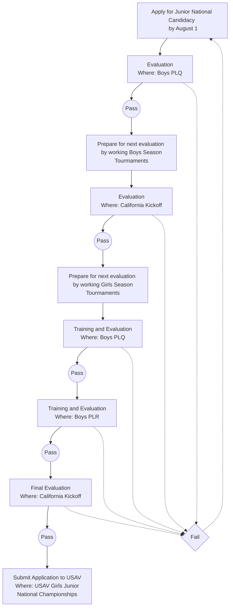

```mermaid
graph TD;
    A[Apply for Junior National Candidacy <br> by August 1]-->B[Evaluation <br> Where: Boys PLQ];
    B-->D((Pass));
    B-.->C{Fail};
    C-.->A;
    D-->E[Prepare for next evaluation <br> by working Boys Season Tourmaments]
    E-->F[Evaluation <br> Where: California Kickoff]
    F-->H((Pass));
    F-.->C;
    H --> I[Prepare for next evaluation <br> by working Girls Season Tourmaments] 
    I --> J[Training and Evaluation <br> Where: Boys PLQ]
    J-->L((Pass));
    J-.->C;
    L-->M[Training and Evaluation <br> Where: Boys PLR]
    M-->O((Pass));
    M-.->C;
    O-->P[Final Evaluation <br> Where: California Kickoff]
    P-->R((Pass));
    P-.->C;
    R-->S[Submit Application to USAV <br> Where: USAV Girls Junior <br> National Championships]
```
